## Multiplex Analysis Web Apps (MAWA)

### NCI CBIIT

## Welcome

Welcome to the Multiple Analysis Web Apps (MAWA) presented by NCATS-NCI-DMAP. This is your one stop resource for data exploration, algorithm tuning, and figure generation. The below is a guide to using this app with suggested workflows, step-by-step instructions, and FAQs.

## MAWA Sections

- [File Handling](#1-file-handling)  
- [Coordinate Scatter Plot](#2-coordinate-scatter-plot)  
- [Phenotyping](#3-phenotyping)  
- [Phenotype Clustering Workflow](#4-phenotype-clustering-workflow)  
- [Spatial Interaction Tool](#5-spatial-interaction-tool)  
- [Neighborhood Profiles Workflow](#6-neighborhood-profiles-workflow)
    - [Neighborhood Profiles](#6a-neighborhood-profiles)
    - [UMAP Differences Analyzer](#6b-umap-differences-analyzer)
    - [Clusters Analyzer](#6c-clusters-analyzer)
- [Radial Profiles](#7-radial-profiles)  
- [Utilities](#8-utilities)

### 1. File Handling

As with most projects, the first step in starting your analysis workflow is with importing the data you intend to use. This is argueabely the most important step and one where the most issues may arise. If you any questions at all about importing and exporting data to not hesitate in seeking help from a DMAP team member (Dante and Andrew).

#### NIDAP Infrastructure

NIDAP manages files using a product called Compass. Compass is akin to other file management systems like Windows File Explorer and Apple Finder. Data (.csv, .txt, .png, etc files) are stored in a DATASET, which can be thought of as a file folder. It is the goal of this app that as data is made available to be processed, it is stored in a NIDAP DATASET. Similarly, as results, figures, and updated datatables are generated, these data objects will be placed in a NIDAP DATASET for later sharing, downloading, and storing.

#### 1a. Data Import and Export

1. Select any and all files that you want to import into MAWA from the the left-hand side of the screen in the section titled: **Available input data on NIDAP**.
2. Once those files are selected, click on the button in the middle of the screen that reads: **Load selected (at left) Input Data**.
3. Once the files have finished loading, make sure all selected files are visible on the right-hand side of the screen in the section titled: **Input data available to the tool.**

#### 1B. Datafile Unification

1. On Step 1 of this page, select any and all files that you wish to combine in the table on the left titled: **Select Datafiles**
2. Click the button that says **Combine selected files into single dataframe**
3. Once the files are done combining, review the table at the very bottom of the screen to identify that your data was loaded correctly.
4. Skip Step 2 in this section
5. On Step 3 of Datafile Unification, select the column labeled as `ShortName` for your Image identification. Click the **Assign Images** button to continue
6. On Step 4 of DU, simply click the button that says Assign ROIs and move on to the next step
7. On Step 5 of DU, keep the toggle which reads: **Select number of columns that specify one coordinate axis** to One Column. For the x-coordinate drop down select 'CentroidX' and for the y-coordinate select 'CentroidY'. Keep the micron conversion factor = 1um/pixel. Finalize this step by clicking the button titled: **Assign Coordinates**
8. For the first part of step 6 of the DU, expand the collapsed container and in the first drop down box select the option titled 'One Column for all Phenotypes'. After the page updates, in the second drop down box, select the column titled: `Pheno` or `Pheno_InEx`. Finish this section by selecting the button titled **Select Phenotypes**
9. For the second part of the Step 6 of the DU, once the phenotypes have been extracted, you should see a green box that says, `# phenotypes extracted`. In a table below that, you will see the names of the  phenotypes. You have the option now to rename them to something else, should you choose. I would recommend removing the '+' sign from the phenotype labels in the right-hand column of the renamed phenotypes (There are 5 phenotypes that require this). Once this is done, click on the button titled **Assign Phenotypes**
10. For Step 7 of the DU, save your version of the unified dataset with a memorable name. Keep in mind that it will be prefaced with 'mawa-unified_dataset_'. Click the button titled: 'Save dataframe to csv'.
11. Return to the Data Import and Export Tab and look for your titled dataframe in the dropdown select box in the center of the screen titled: 'Save MAWA-unified datafile to NIDAP'. Once your dataframe is selected, click the button titled: ‘Save Selected (above) MAWA unified datafile to NIDAP’. This may take some time (~1min) to complete. Once done, you will have a permeant version of the unified datafile to use in the future. Load it into the MAWA input space anytime you want to just like you would the base files.

#### 1C. Open File

1. If you have just completed the datafile unification process you will see the toggle at the top of the screen titled **Load Dataset from Datafile Unifier** is ON. Feel free to keep it ON.  
2. Go ahead and click the button below that reads: **Load the selected input dataset**. This may take a moment to complete (~1min). When it has you will see a sample of the dataset. Feel free to review it.  
3. If in the future, you have loaded a previously created mawa-unified dataset, once it is loaded into MAWA memory, you can move directly to this screen and load it using the drop down select box.  

### 2. Coordinate Scatter Plot

### 3. Phenotyping

The second page to start your analysis pipeline is the phenotyping page. This is where you will load your data, view your different feature conditions, and select your phenotyping. There are two primary steps in performing phenotyping.

**Step 0**: Click the button at the top of the screen titled: Load Data. It may take a few minutes to complete (<3 min, working to improve this).
**Step 1**: Once the data is loaded, select a phenotyping method in the top right. The different phenotyping methods are described below. Once a methods has been selected, click the button titled **Apply Phenotyping Methond**. The app currently offers three different phenotyping methods. They are:
    `Species`: The phenotype is set as a direct copy of the species name (species name short to be more precise). The species name is the combination of markers that the cell type is positive for.
    `Markers`: The phenotype is set as one of the given Marker that the cell is positive for. If the cell is positive for more than one Marker, the cell entry in the dataset is duplicated and represented by each positive marker value being studied.
    `Custom`: The phenotype is set as a value of your own choise. Once the Custom phenotyping is selected, the Phenotype Summary Table on the right side of the page becomes editable.

### 4. Phenotype Clustering Workflow

### 5. Spatial Interaction Tool

### 6. Neighborhood Profiles Workflow

Neighborhood Profiles identifies the types of cells that often cluster with one another, and finds patterns of the cluster definitions which occur more often in certain tissue types or health-conditions. This goal of these analyses is to help identify the specific neighborhoods present in a given dataset, and characterize their makeup based on the phenotypes present.

The Neighborhood Profiles Workflow can be used once your data has been properly loaded and phenotyped. Of particular importance is that the your data contains X/Y coordinates for each cell, and each cell is assigned a phenotype. The sections below will show examples of settings and visualizations that can be created in the Neighborhood Profiles Workflow. For these illustrations, we use a sample dataset included with MAWA called **Multiplex_Image_Sample.csv** and selected three markers (ECAD, HistoneH3, and CD45RO) during our phenotyping step. When combined, these three markers create eight unique phenotypes with the *Species phenotyping* method in Thresholded intensities.

#### 6A. Neighborhood Profiles

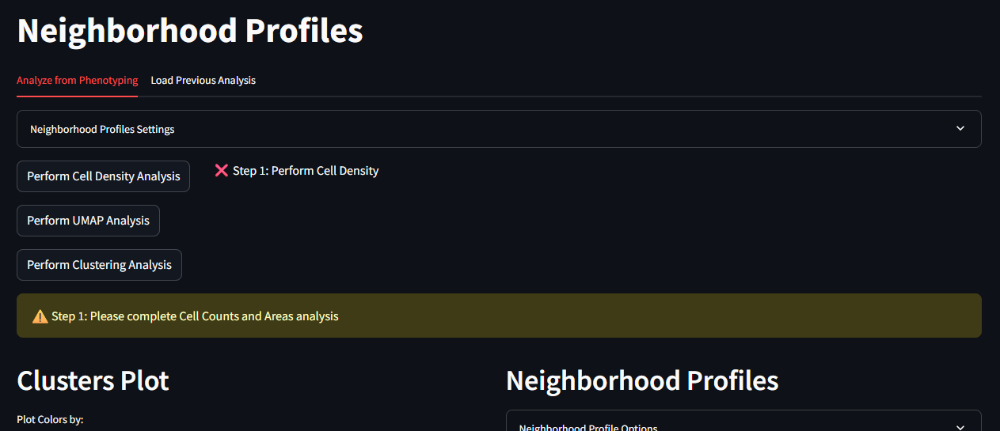

This page is the starting point for running the Neighborhood Profiles. On the top of this page you will see options for running each step of the analysis. At the bottom of the page are placeholder spaces for two figures.

In the top panel, there are the following buttons

* Perform Cell Density Analysis
* Perform UMAP Analysis
* Perform Clustering Analysis

There is also a collapsable container for the Neighborhood Profiles Settings. This container allows you to set the parameters for the Neighborhood Profiles analysis. These settings include:

* Number of CPUs
* Calculate Unique Areas
* Area Filter Ratio
* Percentage of cells to subset for UMAP fitting step
* Subset data transformed for UMAP
* Percentage of cells to subset for UMAP transforming step
* Load pre-generated UMAP model

The bottom figure panels are labeled

* Clusters Plot
* Neighborhood Profiles

#### Instructions - Standard Neighborhood Profiles

1. Start by checking the message text that can be seen in the middle of the screen. If you have not previously completed the phenotyping step, a message will appear as the following.

    

2. If you have finished the phenotyping step, the middle message text should look like the following. This means the app is ready to be used for processing Neighborhood Profiles.

    

3. Begin the cell density analysis by clicking the button *Perform Cell Density Analysis*. This process will take varying amounts on time depending on the size of your dataset, the size of your images, and the number of phenotypes you have selected in the phenotyping step. For a dataset of 48k cells, and 8 phenotypes, this process takes approximately 1 min. When this step has completed correctly, you will see a message in the middle of the screen that reads as the following:

    

4. Next, begin the UMAP Analysis by clicking the button *Perform UMAP Analysis*. Running the UMAP decomposition will take varying amounts on time depending on the size of your dataset, the size of your images, and the number of phenotypes you have selected in the phenotyping step. For a dataset of 48k cells, and 8 phenotypes, this process takes approximately 1 min. When this step has completed correctly, you will see a message in the middle of the screen that reads as the following:

    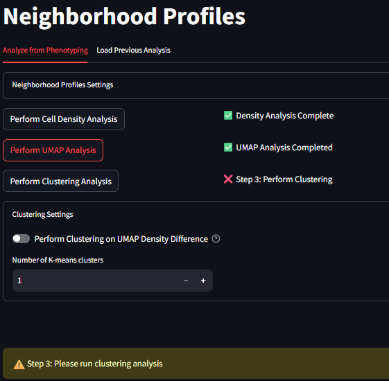

5. Finally, begin the process of clustering the results of the UMAP. At the lower part of the analysis section, select a number of clusters to use for the k-means clustering algorithm. Once a number is selected, click on the button to *Perform Clustering Analysis*. This step is the slowest, and depending on the number of cells in your datasets, could take over 1 min to run. When its complete, the user should see be able to see the scatter below populated and colored by cluster, and the Neighborhood Profiles line plots populated and drawn for the phenotypes included in each cluster.

6. In the Clusters Plot, notice this figure can swap its categorical colors to show the the Cluster label or by the Phenotype label. You can also progress through all the images that are included in your dataset and see how the clusters have partitioned individual tissues samples

    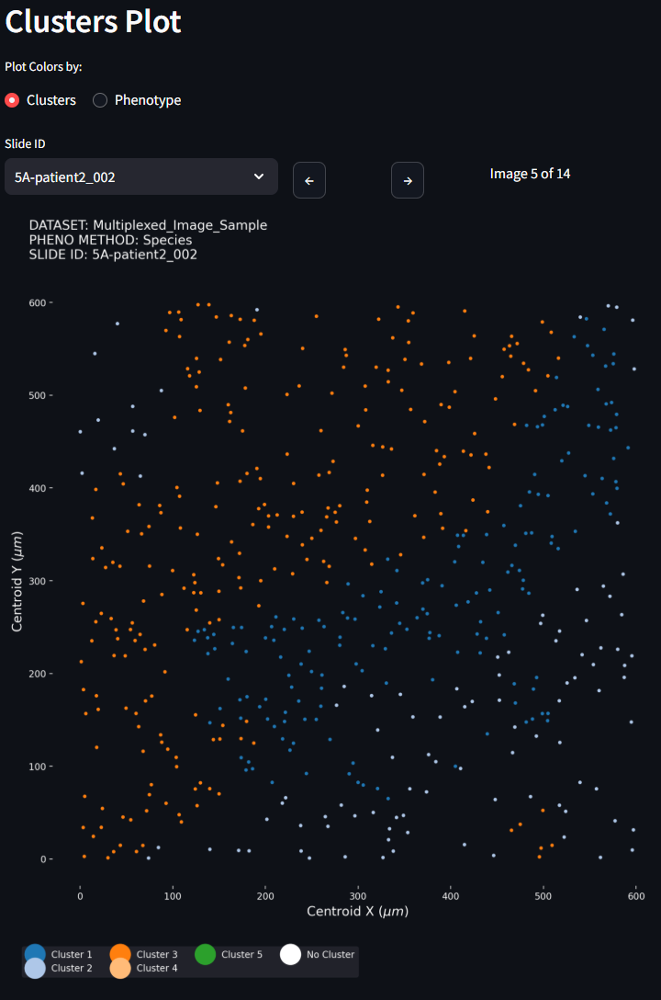

7. The Neighborhood Profiles line plot, shows the make up (profiles) of each of the clusters (neighborhoods) created by the k-means clustering algorithm. These line plots show the mean density measurement of the number of cells for a given phenotype (counts /mm2) within different annuli surrounding the cells of that given cluster. The error bars are the Standard Error of the Mean (SE). Different clusters can be selected from the drop down menu. All figures are scaled to fit on the same axes, and as such, any one phenotype from any one cluster might contribute more to the overall scale of these line plots. As is often case, there are many cells (often the majority) that are assigned to the 'Other' phenotype. When this other category dwarfs the other phenotypes, it might be helpful to hide the 'Other' phenotype from the figure. This can be done in the Options menu seen in the second image below. As you test differences in your UMAP results as a factor of the k-means cluster size, your Neighborhood Profiles line plots will change, you an opportunity to tune and test your experimental assumptions.

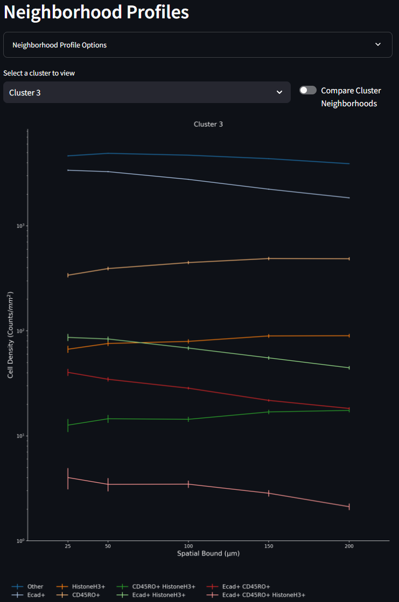

  

* Manual Y-axis Scaling: The default behavior for this toggle is off. That means that by default the Neighborhood Profiles figure will automatically scale based on the data present. By turning this toggle on, users can manually adjust the y-axis scaling to better visualize their data.
* Y-axis Min and Y-axis Max: These two fields allow users to set the minimum and maximum values for the y-axis. This can be useful for zooming in on specific areas of interest within the data. These values do nothing if the Manual Y-axis Scaling is set to off.
* Log Scale: This toggle allows the y-axis (density) to be drawn on a logarithmic scale. The default behavior is on, since through testing it has shown to be more informative for visualizing the data on linear scale.
* Hide 'Other' Phenotype: The 'Other' Phenotype is a phenotype assigned to cells that are negative for the chosen markers. As such this phenotype can be assigned to many, many cells that do not neatly match the experimental marker classifications. With such higher densities showing up in the 'Other' phenotype, it can skew the y-axis range and make it difficult to visualize the other phenotypes. By turning this toggle to on, the 'Other' phenotype will be hidden from the figure and the y-axis will be auto-scaled for the other phenotypes.

#### Instructions - UMAP Density Difference Neighborhood Profiles

The UMAP Density Difference Neighborhood Profiles is alternative way to perform your Neighborhood Profiles analysis. The steps 1-4 from the Standard method are the same as this method. The difference comes when you being clustering. Instead of applying the clustering algoirthm to the full dataset, the clustering is applied separately to parts of the dataset that meet a specific feature condition.

5. After finishing the UMAP Analysis, and before the clustering, you will need to select the toggle in the Clustering Settings to enable the Density Difference mode. Once on, the settings window will display additional options for configuring the clustering analysis.

    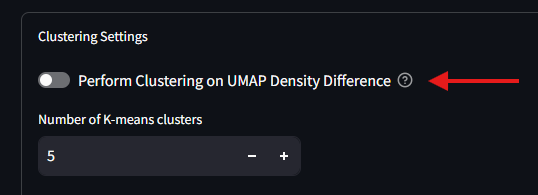

    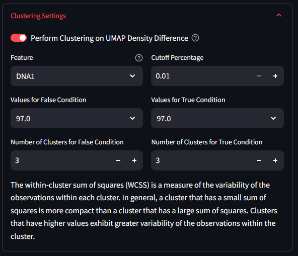

6. Select a Feature to split the data on using the first drop down list in the Clustering Settings panel. This list will include all Features of your dataset. After you select a Feature, you will see the values drop-boxes in the middle of the settings box change to match values that can be found in the dataset for that Feature. However, not all features are appropriate for splitting your data into two halves. For this reason, a few checks are performed to verify the feature can be split. Any chosen Feature that has two and only two unique values are easily split along this binary. You will notice that the Values dropdown will default to those two values. If the values are numerical and there are over 15 unique values, the algorithm assumes its a continuous value and will split the data at the median value. If the values are numerical and there are between 2 and 15 unique values, then the algorithm will assume some sort of categorical variable, and will allow you to choose which two variables to use. If the feature has less than two unique values, or if it is a category or object type, then the algorithm will not be able to split the data and will warn you that this is not an appropriate feature for splitting.

7. Select the number of clusters you want to use for each of the split datasets. This determines how many clusters the k-means algorithm will create for each subset of the data. This might be a value that you tweak and adjust as needed.

8. Click the button to *Perform Clustering Analysis*. This step is the slowest, and depending on the number of cells in your datasets, could take over 3 min to run. When its complete, the user should see be able to see a number of UMAP figures appear to the right of the analysis buttons

    

#### UMAP Density Difference Neighborhood Profiles Interpretation

Looking at the above figure there is a lot to take in. The top figure is the completed UMAP of the full dataset before splitting. The middle-left and middle-right UMAPS are the subsets of the UMAP data based on on the Feature selection in step 6 above. By subtracting the data in the middle-right figure from the data in the middle-left figure, you achieve a visualization of the differences in neighborhood profiles between the two subsets; the figure in the middle of the figures grouping.  

The full UMAP, the lower Feature UMAP and the upper Feature UMAP are all shown on a density scale with a dark violet color indicating lower density, and a bright yellow color indicating higher density. The spectrum of densities in the UMAP are shown with the spectrum of colors between dark violet and bright yellow.  

For the difference UMAP, the color scale is a gradient from bright blue to white to bright red. The blue shows areas of the UMAP where the lower Feature UMAP has a higher density of cells compared to the upper Feature UMAP, while the red shows areas where the upper Feature UMAP has a higher density of cells. Areas of white signify no difference in density between the two subsets. Areas with a dull blue or a dull red show a higher density for one of the subsets over the other, but not a terribley strong effect. It is at this stage that the algorithm and the user can make a decision about which parts of the difference UMAP to continue using. In the Clustering settings box, there is a setting in the top right which reads as *Cutoff Percentage*. This value is the percentage of the maximum density difference that will be used to filter the UMAP results. The lower the number used here, the less restrivtive the algorithm, and more data from the difference is used.  

Once the cutoff filtering has been performed on the difference UMAP, the figure will be masked to only show those UMAP values that are the 'strongest' representation of the lower and upper Feature values. Any UMAP values that pass the cutoff will be considered representative of the target Feature conditions and will show up as one color of bold blue or bold red. This end result is show in the lower-left figure, which is called the difference masked UMAP.  

Once the masking step is achieved, clustering can begin. A k-means clustering model is applied to each dataset subset, the bold blue UMAP and the bold red UMAP from the difference masked UMAP. The number of target clusters used for each clustering model is determined by the user in step 7 above. Any cells that included in the UMAP calculation but were masked out of the difference UMAP are assigned a cluster of 'No Cluster'. The results of the clustering is shown in the lower-right figure. UMAP data that are assigned the 'No Cluster' label are show in white. UMAP data that are assigned to lower Feature are shown in shades of red, and UMAP data that are assigned to the upper Feature are shown in shades of blue. There are shades of blue and red to indicate the different clusters used for each k-means algorithm. In our example with three clusters each, our clustered labels are True Cluster 1-3 (blue) and False Cluster 1-3 (red).  

From this point, the Neighborhood Profiles workflow can continue as normal. Whenever a cluster is selected to be viewed, compared or analyzed, a user may select from any of the clusters that were generated. We also included an average cluster for each Feature condition. This can help if inter-cluster differences are not as scientfically relevant as the differences between the two Feature conditions.  

At the bottom of the Neighborhood Profiles page, there are a number of pre-generated Neighborhood Profiles figures that may be helpful to quickly investigate difference aspects of your results. If there are specific pre-generated figures you would like to see, please let us know.

#### 6b. UMAP Differences Analyzer

After completing the UMAP decomposition and clustering analysis, the user may now take a look at the down-stream figures generated as a result of these analyses. While there are not many levers and knobs to change the data implicitly here, the user can generate different figures.

1. Before starting to view these Clustering Differences, you must complete at least the UMAP processing seen on the previous page. To experience the full offering of the Clustering Differences page, you must also complete the Clustering step on the previous page. There are warnings on the page to help you remember what needs to be completed in order to see each figure.
2. The Figures that are available for viewing:  
    1. Full 2D UMAP
    2. 2D UMAP filtered by lineage and features
    3. Different UMAP scaled by features

#### 6c. Clusters Analyzer

The final step in the Neighborhood Profiles workflow is the Clusters Analyzer. Again, this page will be most useful after all three analysis steps from the [Neighborhood Profiles](#6a-neighborhood-profiles) page are completed. The Clusters Analyzer page contains two figures generated from the Neighborhood Profiles analysis:

1. [Phenotype/Cluster Heatmap](#phenotypecluster-heatmap)
1. [Incidence Figure](#incidence-figure)

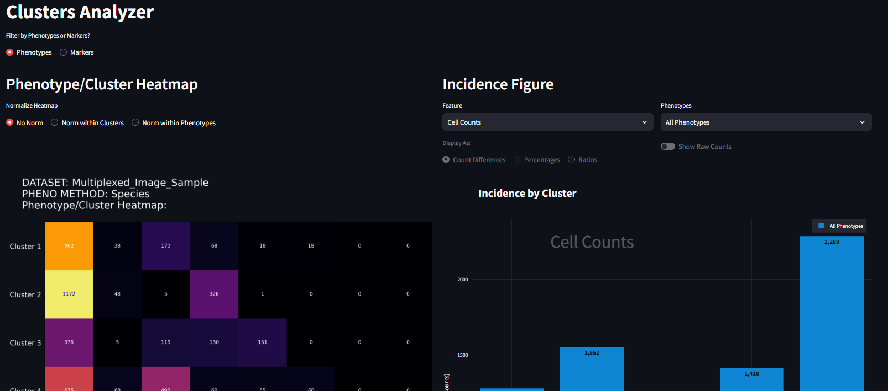

These figures have been created to investigate the composition of phenotypes of cells in assigned clusters, and the feature expression of cells in assigned clusters. Each figure can be customized further using the options available in the interface. Each figure can be exported for use in other applications by right-clicking on the image and clicking 'save as'.

IMPORTANT: All of the values displayed in the figures on this page are measured from the cells used in the UMAP processing step (Step 2 in the [Neighborhood Profiles](#6a-neighborhood-profiles) page). It is likely the case that the cells used in the UMAP step are a subset of the full dataset, and as such, the values shown in these figures may seem smaller than what the full dataset describes. If you want the UMAP model to be applied to all cells in your dataset, you can change the Neighborhood Profiles Settings to transform the full dataset. Using the full dataset will take longer to run, and will not necessarily improve the results of the clustering analysis.

The sections below will show examples of settings and visualizations that can be created in the Clusters Analyzer page. For these examples, we used a sample dataset included with MAWA called **Multiplex_Image_Sample.csv** and selected three Markers (ECAD, HistoneH3, and CD45RO) for our phenotyping step. When combined, these three markers create eight unique phenotypes with the *Species phenotyping* method in Thresholded intensities.

#### Phenotype/Cluster Heatmap

The heatmap offers a view of the number of each phenotyped cell located within each cluster. The heatmap can be modified using a toggle switch for heatmap normalization. These widgets have the following properties.

`Normalization Toggle`: This toggle switch allows you to change the normalization method applied to the heatmap. The normalization options are as follows:

1. No Norm (default): No normalization is applied to the heatmap. The relative colors for each cell is scaled for all cells in all phenotypes and in all clusters. The sum of each number shown in the grid corresponds to the total number of cells transformed by the UMAP model.

    

2. Norm within Clusters: The grid values are decimal values of the number of cells within a cluster assigned to a given phenotype. In this schema, the relative color of the grid is based on the within-cluster distribution. The sum of the numbers in each row sum to 1.

    

3. Norm within Phenotypes: The grid values are decimal values of the number of cells within a phenotype assigned to a given cluster. In this schema, the relative color of the grid is based on the within-phenotype distribution. The sum of the numbers in each column sum to 1.

    

#### Incidence Figure

The incidence figure is one way to represent the counts of the cells present in each cluster. In this example I choose the standard form of clustering analysis with 5 clusters. When it is first loaded, it looks like the following (Figure 1):

The incidence figure details how the cells within each cluster differ in their expression of the data features recorded alongside the cell positions and marker values. These features range from boolean values (True/False), continuous values (-1, 0, 1), and string values('time0'). There are two selection boxes to augment the indicence figure, and a radio button to select the type of comparison to perform. They are the following:

`Feature Select Box`: Features that can be considered for the Incidence figure.

* Cell Counts: The number of cells assigned to a given cluster (Default)
* Other features from your datasets: Columns from your dataset by which you want to directly compare TWO conditions. At this time, this works best with Boolean data (True/False), but also works with range data (x>0, x<0). Once a feature is selected, the incidence plot no longer shows a pure count, but instead a comparison of the two conditions within the feature.

`Phenotype Select Box`: The phenotype the cells being plotted. The options shown are:

* All Phenotypes: Shows all cells irrespective of phenotype (Default)
* VIM+, ECAD+, VIM+ECAD+, Other, etc...: Shows only the cells that express for the specifically chosen phenotype (created during the Phenotyping stage of the workflow).

`Display-as Radio Button`: How the values of the Feature select box should be displayed. This radio button is disabled for the Cell Counts condition, but is enabled for any other Feature selection. For each of the options shown below, there are equations detailing how the values for each condition are calculated. For equations 1-4, *d* represents the full datasets, and the *Condition* is the Feature and Value combinaton being condisdered. Any time there is a subscript of *Clust* then the operation is performed separately for each cluster. Therefore when a feature is selected, the dataset will be split as follows

$$
\begin{aligned}
d_{\text{cond0}} = d \subset Condition0 \quad\quad\quad \text{Equation 1a}\\
d_{\text{cond1}} = d \subset Condition1 \quad\quad\quad \text{Equation 1b}\\
\end{aligned}
$$

The options to be displayed are:

* Count Differences: The value shown on the y-axis is the difference between the quantity of cells in a cluster in the lower condition subtracted from the quantity of cells in that cluster in the upper condition.

$$
\begin{aligned}
d\_count_{\text{clust, cond0}} &= |d_{\text{clust, cond0}}| \hspace{7.15cm} \text{Equation 2a} \\
d\_count_{\text{clust, cond1}} &= |d_{\text{clust, cond1}}| \hspace{7.15cm} \text{Equation 2b} \\
d\_diff_{\text{clust}} &= d\_count_{\text{clust, cond1}} - d\_count_{\text{clust, cond0}} \hspace{3.35cm} \text{Equation 2c}
\end{aligned}
$$

* Percentages: The value shown on the y-axis is the percentage of cells that match a feature condition in that given cluster. The sum of the values across condition for all clusters would equal 100%.

$$
\begin{aligned}
d\_total_{\text{cond}} &= \sum_{\text{clust}} d\_count_{\text{clust, cond}} \hspace{2.75cm} \text{Equation 3a}\\
\text{Percentage}_{\text{clust, cond}} &= \frac{d\_count_{\text{clust, cond}}}{d\_total_{\text{cond}}} \times 100\% \hspace{2cm} \text{Equation 3b}
\end{aligned}
$$

* Ratios: The value shown on the y-axis is the ratio of r1/r0 where r1 is the percentage of cells that match the feature of condition shown on y>0 in that cluster, and r0 is the percentage of cells that match the feature of the condition show on y<0 in that cluster.

$$
\begin{aligned}
&d\_total_{\text{cond}}^{\text{adj}} = \sum_{\text{clust}} (d\_count_{\text{clust, cond}} + 1) \hspace{3.3cm} \text{Equation 4a} \\
&\text{Percentage}_{\text{clust, cond}}^{\text{adj}} = \frac{d\_count_{\text{clust, cond}} + 1}{d\_total_{\text{cond}}^{\text{adj}}} \times 100\% \hspace{1.55cm} \text{Equation 4b} \\
&\text{Ratio}_{\text{clust, cond}} = \log_{10} \left( \frac{\text{Percentage}_{\text{clust, cond1}}^{\text{adj}}}{\text{Percentage}_{\text{clust, cond0}}^{\text{adj}}} \right)  \hspace{2.3cm} \text{Equation 4c}
\end{aligned}
$$

`Show Raw Counts Toggle`: This toggle switch is enabled for any Feature selection other than Cell Counts. When a feature is selected from the `Feature Select Box`, one of the three Display-As analyses are performed to show a line plot of the Incidence for that feature across clusters. This line plot is a very simply comparison of two numbers, and it can hide the magnitude of the raw cell counts. By turning this toggle to true, a bar plot is displayed underneath the line plot. This is meant to help guide the eye to the magnitude of the differences being displayed by this comparison condition.

#### Example workflow for Incidence Figure

There are two drop-down menus for Feature and Phenotype, the defaults of which are Cell Counts and All Phenotypes respectively. Below the drop-down tables is a set of radio buttons and a toggle switch, the default states of which are disabled. Following these widgets is the Incidence Figure. On the figure, the specific clusters are specified on the horizontal axis. The vertical axis is the incidence being described. In its default state (Cell Counts), the bar plot shows the number of cells present in each cluster, irrespective of phenotype. To be specific, these are the counts of cells that were clustered. The clustered cells are not always your full dataset; it depends on how you perform the UMAP step before the clustering. See the Neighborhood Profiles Settings section for how to sample your data for UMAP. In this example, we sampled about ~7300 total cells. This bar plot, shows the distribution of where those 7300 cells fall in each cluster.

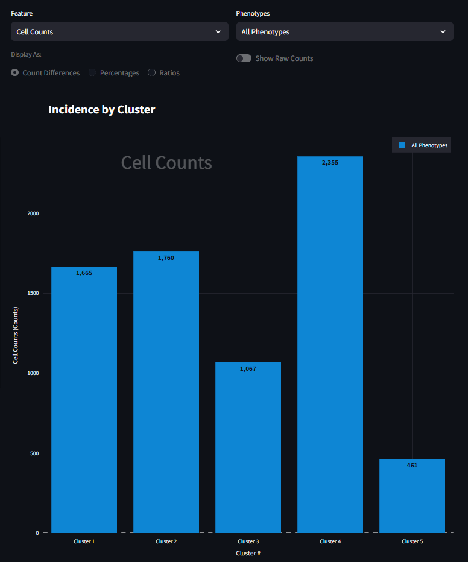

It looks like Cluster 5 has the fewest number of cells, and Cluster 4 has the most. At its core, this is the starting point for using this figure. Here we can begin to understand the presence of cells within each cluster. We next start to drill down into the data a bit further and look at how cells of a specific phenotype are represented in each cluster. For example, to investigate how CD45RO+ HistoneH3+ is represented in each cluster, you can select that phenotype from the right menu and the figure will adjust to look something like the figure below. Here the scale is much smaller, and that the bar plot distribution changes. This is now a subset of the data seen in the previous figure, only CD45RO+ HistoneH3+ cells are shown instead of all cells. It also appears that the great majority of CD45RO+ HistoneH3+ cells are found in Cluster 5 and not many at all in the other clusters.

Now this first example focuses on pure Cell Counts and does not consider specific feature differences. This figure was built to also show some differences for specific Features or measurements of the data other than phenotype. In this sample dataset, there is a feature called DNA2. The values of DNA2 are all numerical and are a continuous measurement. The left side drop-down menu contains a list of all available features in the dataset as well as the default entry of *Cell Counts*.  When a Feature other than *Cell Counts* is selected, the dataset will split into two halves based on the values in the dataset. Selecting a Feature will also enable the radio buttons and the toggle switch.

If the selected Feature contains exactly two unique values, then the dataset will be evenly split between the values, and the figure will look similar to Figure 3. If the feature column contains has more than 2 unique values and the values are numerical, then the median value of the range will be found, and the data will be split evenly around the median. If the feature column only has 1 or fewer unique values, or is made up of string values, MAWA will tell the user that the data cannot be easily split and comparison on this Feature is innapropriate.

When the first radio button is selected, the figure draws the visualization as *Counts Differences*. This line graph is the difference of the quantiy of cells that match the Upper condition subtracted from the quantity of cells that match the Lower condition (Eq 1). For a given cluster, if the drawn line falls above the horizontal axis, then there are more values in the Upper condition than there are in the Lower condition, and vice versa. As you might expect, you can drill down further into the data by selecting different Phenotype subsets in combination with the Feature selection. When the *Counts DIfferences* option is selected, you can also enable the `Show Raw Counts Toggle`. This will display bar graphs of the actual raw counts for each condition. This gives a more complete picture of the magnitude of the underlying differences be shown. For more information refer to equation 2 above.

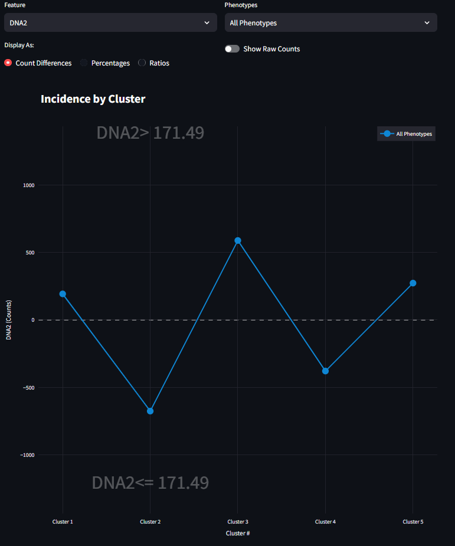

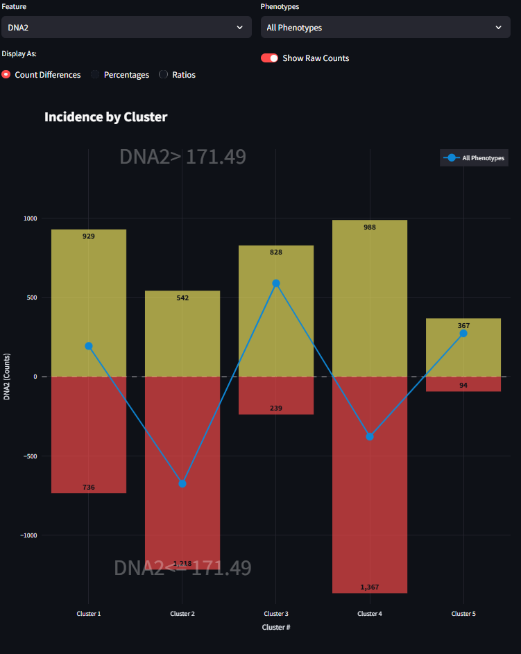

When the second radio button is selected, the figure draws the visualization as a *Percentage*. Presently, this *Percentage* focuses only on the Upper condition of the Feature. This calculates the percentage of Upper value cells in each cluster that across all Upper value cells. This means that the percentages seen in this line plot (in our example, five percentages) should sum to 100%. For more information refer to equation 3 above.

Finally, when the third radio button is selected, the figure draws the visualization as a *Ratio*. This *Ratio* returns to a comparison between the Upper and Lower conditions of the selected Feature. Specifically, each value on the visualization is the ratio of the percentages generated from the previous visualization. Since there are scenarios where a percentage could be 0% for a given cluster, the math is slightly adjust for the calculation of the percentages used for the ratio. For more information refer to equation 4 above. The aim of this *Ratio* is to illustrate the magnitude of how many more (or fewer) cells appear for a condition for a given cluster. This ratio is displayed on a log10 scale.

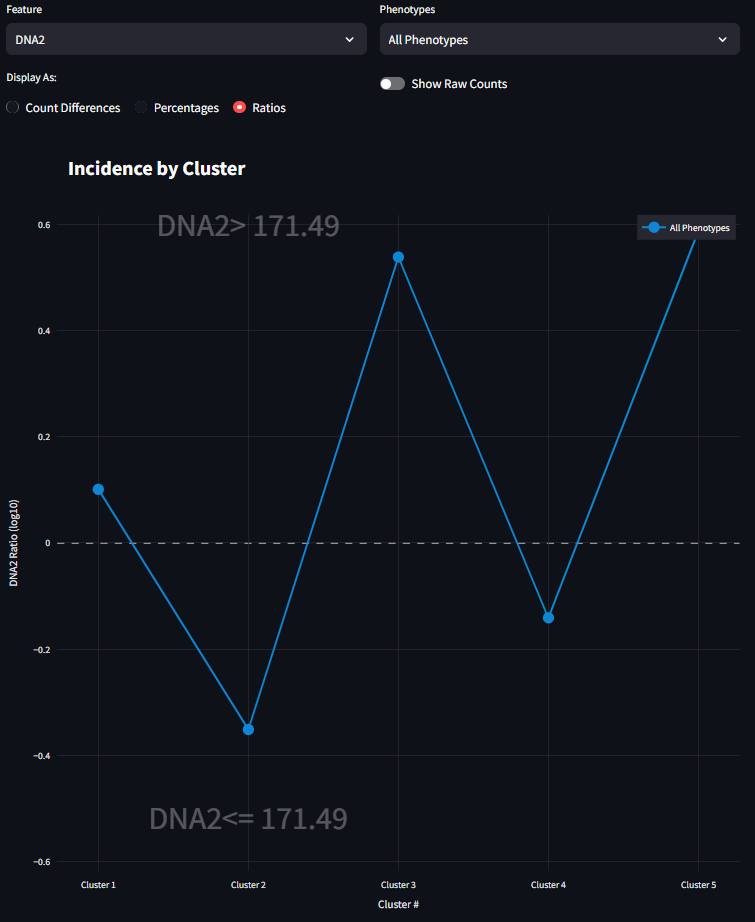

### 7. Radial Profiles

### 8. Utilities
