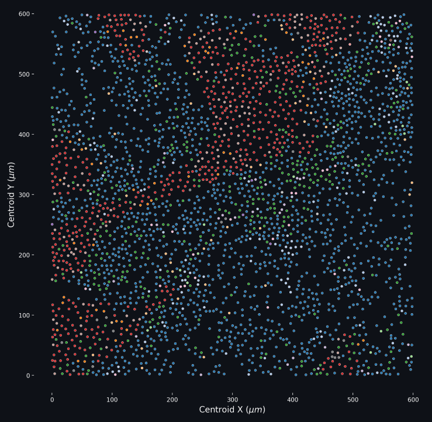

# Phenotyper

The Phenotyping app is your first opportunity to view your data and ascribe descriptions to the cell position data that you have collected. There are many features to unpack in the the Phenotyping page, but the most important one are loading your data, identifying the markers, and setting the phenotype method. 

## Markers
As with most Cytometry data analysis endeavors, this Phenotyping tool requires a dataset with cell position data and 1 or more marker columns. These marker columns at present need to be titled as "Phenotype X" where X is the shortened form of the marker in question and the data is a True/False value.  
When your dataset is loaded into memory, the first preprocessing step that is performed is to identify the markers that are present in the dataset. For example, if the input dataset had three columns labeled "Phenotype Ecad", "Phenotype HistoneH3", and "Phenotype CD14", the markers identified will be Ecad, HistoneH3, and CD14. It is expected that each row (cell) in this input dataset has a value of either True or False for the marker columns. It is acceptable for a given cell to be positive for all of the observed markers, or none of them. 

### Species Name
The next step that the data preprocessing performs is to assign each cell a species name. It does this by observing the True/False values of each marker column and compiling them into a single name that describes all the positive and negative markers. This is a inclusive species name that includes all markers that a cell is positively expressed for. A shorter version of the species name is also generated which is a representation of only the positive markers for a given cell. See below for some examples.

when the preprocessing of the dataset is complete you will see the Phenotype Assignments table populated to something like this

The Phenotypes Assignments table condenses the varying species names found in the dataset and reports the incidence of each species name. Once a phenotype method is eventually chosen, the phenotype column will update with the assigned phenotype. 

## Phenotypes
Once the data has been preprocessed and had the species names generated, the user will have an opportunity to choose a phenotyping method. The current options for phenotyping methods are.
1. **Species**: The phenotype of each cell is to set as the species name (short) of the cell. This includes any markers that the cell is positive for. The phenotype does not include any study markers that the cell is negative for. There is no duplication of cell entries in the species phenotyping method.
1. **Marker**: The phenotype of the cell matches a positive marker for that cell. If that cell is positive for more than one marker, then the cell entry is duplicated for the number of positive markers, each with one of the positive markers. That is to say, each cell phenotype is exclusive in that it can only be one marker type at a time. However cells are duplicated to account for each number of cells that are in fact positive for all studied markers.
1. **Custom**: This method allows the user to assign their own phenotyping name to any given species name. Once custom is chosen as the phenotyping method, the phenotype column of the Phenotype Assignments column becomes editable, and allows the users to assign any name Phenotype like to a species name.
